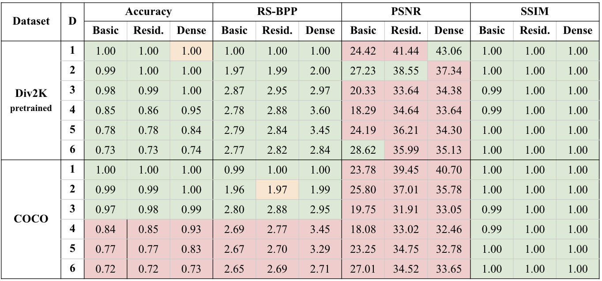
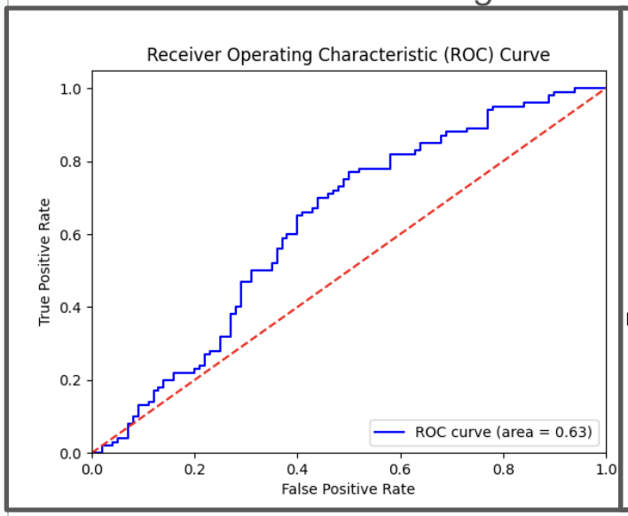

# Introduction

This is a reimplementation of the following paper: https://arxiv.org/pdf/1901.03892, for our CS 4782 Deep Learning final project. We will attempt to recreate the results found in the SteganoGAN paper and explore extensions, while describing our methodology and work process in doing so.

The SteganoGAN paper uses a novel GAN-like architecture and adversarial training to solve the image steganography task. Image steganography is the process of hiding messages within images so that they are undetectable, lossless, and have high information density.

The paper also develops their own metric Reed-Solomon Bits Per Pixel to assess the data capacity of a specific steganographic network. They achieve a RS-BPP of 4.4, 10x higher than previous approaches, while also maintaining high-quality, realistic images that can avoid steganographic detection tools with an auROC of 0.59.

# Chosen Result

We wanted to specifically reproduce the Div2K section of the above table, and the entirety of the above graph.

The table is significant because it indicates that much higher data depths are possible than previously thought, while the graph is significant because it shows that even with high data depths, the outputted image is realistic enough to trick steganographic analysis tools.

Beyond these two figures, we also wanted to determine the usefulness of RS-BPP, observe the differences causes by different image sizes, and test various perturbations including larger data depths, longer training time, and switching the order of leakyReLU and BatchNorm.

# GitHub Contents

All our code and a makefile to run it can be found in the `code` folder.

The training, validation, and 2 testing sets that we used in our implementation can be found in the `data` folder.

Our poster/slide presentation of our work can be found in the `poster` folder.

Our 2/3 page written report of our work can be found in the `report` folder.

Our saved models, the original results from the paper, along with data/visualizations/graphs describing the results of our work can be found in the `results` folder.

# Re-Implementation Details

Since we wanted to recreate the results of the paper, we tried our best to stick as closely to the original architecture as possible, but since a couple years has passed, we decided to make some modifications to include more modern techniques when applicable.

We implement the same encoder variants (basic, residual, dense) along with the same decoder and critic used by the paper. We follow their two phase training process of encoder/decoder first, and then the critic along with the hyperparameters and gradient clipping tricks described in section 3.3 of their paper.

Note that we only train on the 4x compressed Div2K dataset in order to make the compute feasible. However, we do test on both COCO and 4x compressed Div2K imags.

We used the more modern optimizer of AdamW over Adam, and we use Pillow image normalization instead of the manual technique provided in the paper.

Finally, we test against only StegExpose (a traditional analysis tool) to save time and compute (instead of also training/testing against NN steganalysis tools)

# Reproduction Steps

Most of our code is much easier to run if you can run `make` commands, so we highly suggest installing GNU make.

First navigate into the `code` folder, and set up the runtime environment using `make venv` and `make install`.

The datasets are already downloaded in the `data` folder, but if you want to redownload it you can use the `make dataset` command.

You can train a specific model with a set data depth and number of epochs using the `make train` command.

- However, if you want to batch train everything we did, you can first run `make train-all` to do all the normal network training.
- You can then do `make train-all-depth`, `make train-all-leaky`, and `make train-all-long` to train our perturbed networks.
- Training takes around 15 seconds per epoch on an RTX 5070 Ti GPU, and around 15-20 minutes on a M1 Mac CPU.

You can visualize the results of a specific model with a set data depth using the `make metrics` command.

- However, if you want to batch test everything we did, you can first run `make metrics-all` to do all the normal network testing.
- You can then do `make metrics-all-depth` to test one of our perturbed networks.
- Testing takes 2-3 minutes per model tested on a M1 Mac CPU.

You can test out a specific model with a set data depth against the traditional StegExpose analysis tool using the `make analyze-stego` command.

- StegAnalysis takes 5-7 minutes per model tested on a M1 Mac CPU.

Finally, you can run a specific model with a set data depth to encode a specified text message using the `make run` command.

- Two variations of this command to see less details and also see the 95% confidence interval for the network are `make run-small` and `make run-accuracy`.
- This command takes 2-3 minutes per model tested on a M1 Mac CPU.

More details about any of the command line arguments used in the makefile can be obtained by adding the `--help` flag. Good luck reimplementing!

# Results/Insights

The accuracy and RS-BPP results largely align with the original paper, indicating high data density, though the COCO dataset performed worse likely due to lack of training exposure. While our PSNR scores are slightly lower—possibly due to normalization differences—our unusually high SSIM scores (often near 1) appear unreliable given limited training and may also stem from normalization issues, though we didn’t have time to verify this.

Our re-implementation achieved a slightly higher auROC (0.63 vs. 0.59) than the original paper using StegExpose, indicating a minor difference in detectability and suggesting we likely successfully replicated the results of the paper, though our lower RS-BPP on COCO supports the paper’s hypothesis about structural differences in image content.

As an end-result, you can expect a working Steganographic Network which can be used to encode and decode passed in text messages, while also having the ability to verify the success of this network through numerous metrics and steganographic analysis.

# Conclusion

We successfully recreated a GAN-based model capable of hiding messages in images while closely matching—or even surpassing—the original SteganoGAN’s performance on several metrics. Despite this, limitations such as heavy dataset compression, lack of an independent test set, and normalization inconsistencies introduce uncertainty to our results. The project highlighted the critical role of computational resources, and we believe that with more powerful hardware and less-compressed datasets, our findings could be further validated and extended.

# References

[1] SteganoGAN: https://arxiv.org/abs/1901.03892

[2] Div2K: https://ieeexplore.ieee.org/document/8014884

[3] COCO: https://arxiv.org/abs/1405.0312

[4] Steg Analysis Tool: https://github.com/b3dk7/StegExpose

# Acknowledgements

Credits to CS 4782 staff/students for incentivizing us to work on this project, while also providing an outlet to share our results.

Big thanks to Pablo Raigoza (GitHub: PabloRaigoza) for lending us a RTX 5070 Ti GPU for this project, making most of our finding possible.
