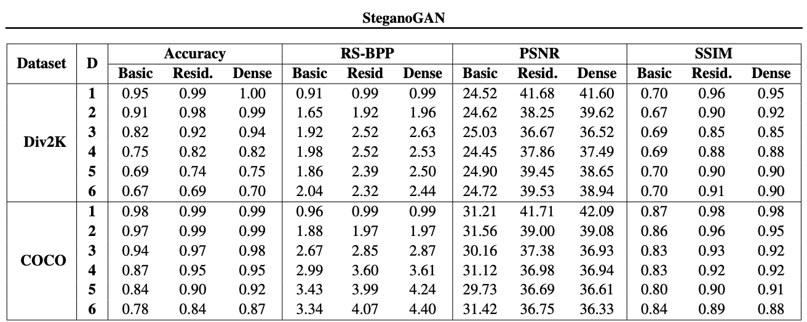
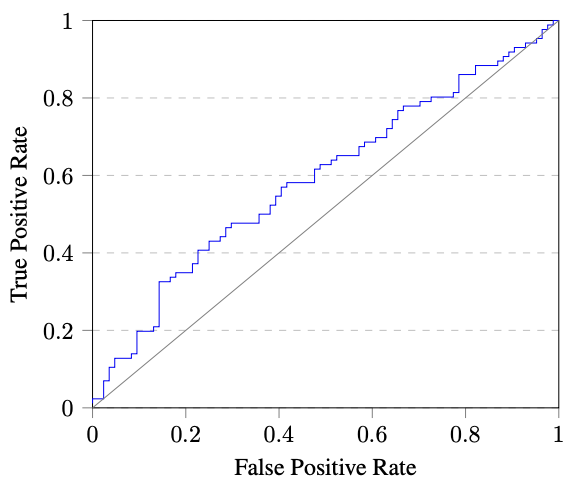
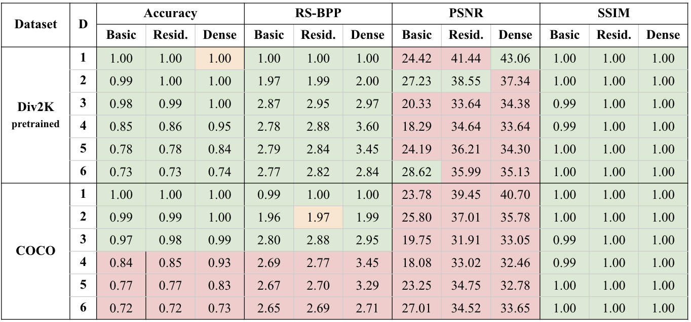
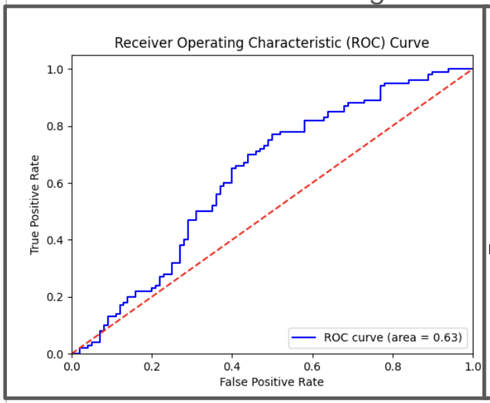
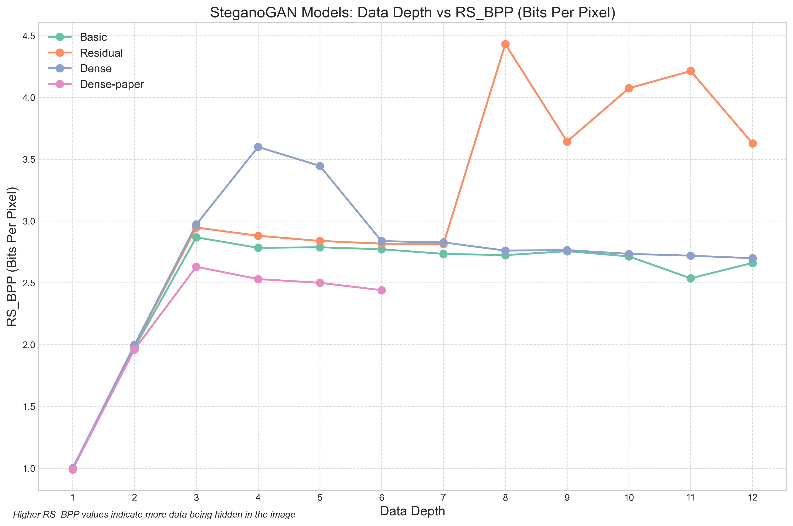

# Introduction

This is a reimplementation of the following paper: https://arxiv.org/pdf/1901.03892, for use in our CS 4782 Deep Learning final project. We will attempt to recreate the results found the in the above paper and describe our methodology and work process in doing so.

# Chosen Result

We wanted to specifically reproduce the 4.4 RS-BPP at a high auROC achieved in the paper, investigate deeper data depths, and verify RS-BPP accuracy through calculating the variance of the accuracy of decoded bits.

# GITHUB CONTENTS

# RESULTS/INSIGHTS

The accuracy and RS-BPP results largely align with the original paper, indicating high data density, though the COCO dataset performed worse likely due to lack of training exposure. While our PSNR scores are slightly lower—possibly due to normalization differences—our unusually high SSIM scores (often near 1) appear unreliable given limited training and may also stem from normalization issues, though we didn’t have time to verify this.

Our re-implementation achieved a slightly higher auROC (0.63 vs. 0.59) than the original paper using StegExpose, indicating a minor difference in detectability and suggesting we successfully replicated and even surpassed the previous Pareto frontier, though our lower RS-BPP on COCO supports the paper’s hypothesis about structural differences in image content.

# CONCLUSION

We successfully recreated a GAN-based model capable of hiding messages in images while closely matching—or even surpassing—the original SteganoGAN’s performance on several metrics. Despite this, limitations such as heavy dataset compression, lack of an independent test set, and normalization inconsistencies introduce uncertainty to our results. The project highlighted the critical role of computational resources, and we believe that with more powerful hardware and less-compressed datasets, our findings could be further validated and extended.

# REFERENCES

[1] SteganoGAN: https://arxiv.org/abs/1901.03892

[2] Div2K: https://ieeexplore.ieee.org/document/8014884

[3] COCO: https://arxiv.org/abs/1405.0312

[4] Steg Analysis Tool: https://github.com/b3dk7/StegExpose

[5] LeakyReLU Image: https://researchgate.net/356162640

# ACKNOWLEDGEMENTS

Credits to CS 4762 for including this project in our courwork,
and Pablo Raigoza for lending a RTX 5070 Ti GPU to this project
